# TripSync

# Descrizione del progetto

TripSync è una web app che aiuta gruppi di amici, coppie o colleghi a organizzare viaggi in modo collaborativo.
Ogni utente può proporre mete, votare attività, gestire il budget comune e creare un itinerario condiviso.

Integra Google Maps, Booking e Skyscanner, permettendo di trovare alloggi, voli e percorsi in un solo luogo.

# Problema

Organizzare un viaggio di gruppo spesso è caotico: troppe chat, confusione sul budget, poche decisioni chiare e nessun sistema integrato.
TripSync risolve tutto con uno spazio unico dove pianificare, votare e gestire il viaggio insieme.

# Target

Giovani 18–35 anni

Gruppi di studenti e lavoratori

Agenzie che organizzano viaggi collettivi

# Requisiti Funzionali

Registrazione/Login (email o Google)

Creazione gruppi di viaggio

Proposte e votazioni

Gestione budget e spese

Itinerario giornaliero

Chat interna

Integrazione Google Maps / Booking / Skyscanner

Export PDF o link del viaggio

# Requisiti Non Funzionali

UI semplice e responsive

Sicurezza con JWT

Scalabilità cloud

Caricamento rapido delle mappe

Uptime ≥ 99%

Compatibile con browser e mobile

# Requisiti di dominio
Sincronizzazione Real-Time: itinerari aggiornati istantaneamente per tutti.

Votazione Democratica: gestione delle tappe a maggioranza di gruppo.

Split-Payment: calcolo automatico dei debiti tra i partecipanti.

Integrazione API: prezzi voli e hotel aggiornati in tempo reale.

Offline Mode: accesso ai documenti e mappe senza connessione.

Sicurezza Dati: crittografia dei documenti e conformità GDPR.

# User Story

# Tabella di benchmarking

# Uml Use Case

# timestamp JWT
1758872765

# Elevator pitch
Buongiorno, sono Riccardo Viapiana, co-founder di TripSync. Se avete mai provato a organizzare un viaggio di gruppo, sapete bene che il divertimento finisce ancor prima di partire: ci si ritrova sommersi da centinaia di messaggi su WhatsApp, link persi e fogli Excel impossibili da gestire. Questo caos trasforma la pianificazione in un lavoro stressante e disorganizzato.

Per risolvere questo problema abbiamo creato TripSync, un’unica piattaforma che centralizza l’intera esperienza. Con la nostra app, l'itinerario, la gestione del budget comune e tutti i documenti di viaggio sono sincronizzati in tempo reale per ogni partecipante. Non siamo un semplice archivio, ma uno strumento sociale che rende la collaborazione fluida e immediata.

Il nostro modello di business è un Software as a Service basato su una struttura freemium: offriamo le funzioni essenziali gratuitamente e un abbonamento Premium per chi desidera strumenti avanzati come la gestione offline e analisi del budget dettagliate. A differenza dei nostri competitor, noi mettiamo al centro l'interazione tra le persone, eliminando definitivamente la frammentazione tra diverse app.

Oggi siamo qui per richiedere un investimento di 50000 € che ci permetta di potenziare l'infrastruttura tecnica e avviare le prime campagne di marketing. Con il vostro supporto, possiamo trasformare il modo in cui il mondo viaggia in gruppo.
# Link lovable
https://travel-hive-co.lovable.app

# WBS 

```mermaid
graph TD
    A["TripSync (MVP - 6 mesi)"] --> B["Project Management & Analisi"]
    A --> C["UX/UI Design"]
    A --> D["Sviluppo Frontend"]
    A --> E["Sviluppo Backend"]
    A --> F["Integrazioni Esterne"]
    A --> G["Testing & QA"]
    A --> H["Deploy & Scalabilità"]
    A --> I["Marketing & Monetizzazione"]

    B --> B1["Raccolta Requisiti"]
    B --> B2["Definizione MVP"]
    B --> B3["WBS & Roadmap"]
    B --> B4["Analisi Rischi"]

    C --> C1["User Flow & Wireframe"]
    C --> C2["Design Responsive"]
    C --> C3["Prototipo Interattivo"]
    C --> C4["User Testing"]

    D --> D1["Auth & Onboarding"]
    D --> D2["Dashboard Gruppi"]
    D --> D3["Votazioni & Proposte"]
    D --> D4["Budget & Spese"]
    D --> D5["Itinerario Giornaliero"]
    D --> D6["Chat Interna"]

    E --> E1["API REST"]
    E --> E2["Gestione Utenti & Gruppi"]
    E --> E3["Votazioni & Consenso"]
    E --> E4["Budget & Transazioni"]
    E --> E5["Itinerari"]
    E --> E6["JWT & Sicurezza"]

    F --> F1["Google Maps"]
    F --> F2["Booking"]
    F --> F3["Skyscanner"]
    F --> F4["Gestione Rate Limit & Cache"]

    G --> G1["Test Funzionali"]
    G --> G2["Test UX"]
    G --> G3["Bug Fixing"]

    H --> H1["Cloud Deploy"]
    H --> H2["Scalabilità & Performance"]
    H --> H3["Monitoring & Uptime"]

    I --> I1["Sistema Abbonamento Premium"]
    I --> I2["Tracking Commissioni"]
    I --> I3["Landing Page"]
    I --> I4["Validazione Business Model"]
```

# Diagramma Gantt

